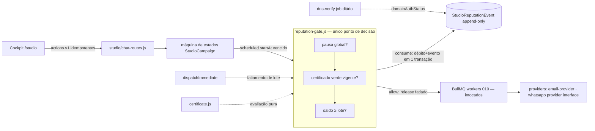

# Architecture Spine — Campaign Studio Cockpit (011)

## Design Paradigm

**Gate-first resource accounting** — toda ação com efeito externo (envio) atravessa
um **gate transacional** que consulta recursos de 1ª classe mantidos como
**ledger append-only**. O gate é o único ponto que decide "pode disparir?";
o ledger é o único ponto que muta saldo. Camadas:

```text
apps/web/src/studio/   → Cockpit (SPA; consome actions e estado, nunca muta recurso direto)
studio/                → rotas + serviços: actions, suggestions, certificate, autonomy, reputation (gate+ledger)
pontos de efeito       → scheduler-worker, dispatch (imediato), workers existentes (intocados como motores)
providers              → email-provider, waha-provider (atrás de interface — AD-11)
```

## Inherited Invariants

| Inherited | From | Binds here |
| --- | --- | --- |
| Constituição II — idempotência, NATS `*.v1` intocados | `docs/constitution.md` | Nenhuma action/ledger quebra reprocessamento; nenhum contrato de evento novo v1 |
| Constituição IV — multi-tenancy por `orgId` + gating premium | `docs/constitution.md` | Toda query do gate/ledger/sugestões filtra org; rotas com `requirePremiumOrg` |
| Constituição VI — sem dependência nova sem justificativa | `docs/constitution.md` | Animações CSS nativas; nenhuma lib nova de UI/estado |
| Constituição VII — GitOps + métricas | `docs/constitution.md` | Deploy pela pipeline existente; gate/ledger/scheduler expõem prom-client |
| D1 (010) — compilação para execuções existentes | spec 010 | AD-2 |

## Invariants & Rules



### AD-1 — Monólito modular gate-first [ADOPTED]

- **Binds:** todos os CAPs
- **Prevents:** extração prematura de serviço; segunda camada de orquestração paralela ao 010
- **Rule:** Todo código novo do Cockpit vive em `studio/` (backend), `apps/web/src/studio/` (SPA) e rotas `/api/studio/*`; nenhum serviço/processo novo; nenhum envio fora dos motores existentes.

### AD-2 — Compilação para execuções existentes [ADOPTED]

- **Binds:** CAP-4, CAP-8, 4.7 (PRD)
- **Prevents:** novo motor de envio; lógica de canal duplicada
- **Rule:** Cockpit compila para `OutreachCampaign`/`WhatsAppCampaign` via `channel-bridge.js`; tracking/reply/inbox permanecem os do 010. Requisitos de canal vivem no compile do bridge — inclusive o descadastro de e-mail (link + headers `List-Unsubscribe` one-click RFC 8058, pedido honrado ≤48h, FR-37), que não pode nascer nos workers.

### AD-3 — Saldo como ledger de 1ª classe

- **Binds:** CAP-4 (FR-14, FR-17, FR-18, FR-20)
- **Prevents:** saldo como JSON solto (padrão `guardrails`); mutação sem trilha; drift entre saldo e histórico
- **Rule:** Entidades `StudioReputationAccount` (`orgId+channel` unique; balance, floor, rampStage, domainAuthStatus) e `StudioReputationEvent` (append-only: `debit|credit|block`, amount, reason, refType/refId — estorno é `credit` com `refId=messageId`, AD-13). `balance` só muta **na mesma transação** que insere o evento correspondente. **Writer único:** apenas `studio/reputation.js` muta accounts; `floor` efetivo e a unidade de débito por Canal são definidos/computados só ali — nada re-deriva. Consulta do painel lê account; auditoria lê ledger.

### AD-4 — Um único gate a montante de todo ponto de efeito

- **Binds:** CAP-4 (FR-15, FR-19), CAP-8 (FR-27)
- **Prevents:** caminho que despacha sem saldo/pausa/certificado — inclusive os descobertos no gate: `processSend` (não checa pausa) e `dispatchImmediate` (enfileira lote inteiro)
- **Rule:** `studio/reputation-gate.js` expõe `evaluate(orgId, channel, units, context) → {allow|block, reason}` e `consume(...)` transacional; **fail-closed** — erro/timeout na avaliação bloqueia com motivo técnico. `consume` é a **autoridade de alocação**: UPDATE condicional (`balance ≥ units`) que retorna a fatia concedida — callers nunca leem saldo e fatiam por fora; a marcação de `scheduledAt`/release ocorre só **depois** do gate. Todo caminho de envio **do Cockpit** chama o gate: (1) scheduler tick antes do release de cada lote; (2) `dispatchImmediate` com **fatiamento** do lote ao saldo concedido; (3) transição scheduled→running (AD-5). A pausa global da org é **estado persistido** (nunca só em memória), checada no mesmo gate, antes do saldo.

### AD-5 — Ciclo de vida: scheduled→running gated; worker checa pausa

- **Binds:** CAP-4, UJ-1 (PRD)
- **Prevents:** campanha `scheduled` que nunca dispara (`tickAll` filtra só `running` hoje); envio após pausa
- **Rule:** `tickAll` inclui campanhas `scheduled` com `startAt` vencido, transitando para `running` **via gate**; `processSend` checa status/pausa da campanha antes de cada envio (paridade com `whatsapp-workers.js`).

### AD-6 — Actions semânticas versionadas e idempotentes

- **Binds:** CAP-2 (FR-8, FR-9, FR-10), CAP-5 (FR-25)
- **Prevents:** duplicação por duplo toque (`set_audience`/`attach_url`/`generate_content` são create-style hoje); quebra silenciosa de automações que consumam actions
- **Rule:** `studio/actions/manifest.v1.js` declara schema + estratégia de idempotência por action; execução registra em `StudioActionRun` com **unique constraint** na chave (`campaignId+action+hash(params)` ou `actionId` do cliente). Breaking change → `manifest.v2.js` side-by-side; v1 nunca muda de forma.

### AD-7 — Certificado como avaliação pura, re-checada no release

- **Binds:** CAP-8 (FR-26…FR-30, FR-37)
- **Prevents:** lógica de bloqueio espalhada; race entre aprovação humana e envio
- **Rule:** `studio/certificate.js` computa checklist determinístico do estado (Saldo ≥ necessário, domain auth, opt-outs **e descadastro configurado**, janela, consentimento WhatsApp por lead, heurísticas do Teste da Maria). Resultado persiste na campanha; o gate **re-avalia** no momento do release — selo vencido/reprovado bloqueia.

### AD-8 — Autenticação de domínio verificada, não declarada

- **Binds:** CAP-4 (FR-16, FR-17, FR-28)
- **Prevents:** pré-condição de SPF/DKIM virar checkbox manual
- **Rule:** `domainAuthStatus` persistido (spf/dkim/dmarc + `verifiedAt`); verificação DNS real na configuração do Canal + job BullMQ diário de revalidação; falha → `floor` do Saldo efetivo zero (gate bloqueia com instrução).

### AD-9 — Sugestões como módulo puro de queries

- **Binds:** CAP-5, CAP-6 (FR-21…FR-25)
- **Prevents:** sugestões dependentes de LLM no caminho crítico; Chip sem motivo citável
- **Rule:** `studio/suggestions.js` gera candidatos por queries declaradas sobre o estado da org com **ranking determinístico**; cada candidato carrega `motivo` (o dado que o motivou); LLM apenas formula a copy do chip (opcional, cacheada). Sem candidato forte → lista vazia (graceful degradation é ausência, nunca chip fraco).

### AD-10 — Contrato de Autonomia em módulo único

- **Binds:** Contrato de Autonomia (PRD §4.6: FR-31…FR-34)
- **Prevents:** regra de despertar espalhada por scheduler/notify/UI; fadiga de notificações
- **Rule:** `studio/autonomy.js` é a tabela fechada `evento → wake|silent + prioridade` (1º lote, anomalia de saldo/entrega, erro de conteúdo, bloqueio por saldo, rejeição WhatsApp); despertares passam pelo orçamento diário por org (janela + agregador); fora da tabela, decisão é silenciosa e registrada (log explicável).

### AD-11 — Transporte WhatsApp atrás de interface de provider

- **Binds:** 4.7 (FR-35, FR-36), risco C-1 do PRD
- **Prevents:** acoplamento ao WAHA que torne a migração Cloud API uma reescrita
- **Rule:** Gate, Certificado e fluxos do Cockpit conversam com a **interface de provider** de WhatsApp (a mesma abstração de `email-provider.js`); WAHA é o provider atual, Cloud API oficial será um novo provider — nenhuma regra de negócio lê detalhe de transporte. O consentimento de WhatsApp é **persistido e auditável por lead** (modelo próprio), consultado pelo Certificado — nunca inferido em memória.

### AD-12 — Herdadas e vigentes [ADOPTED]

- **Binds:** todos
- **Prevents:** re-decisão do que a constituição/010 já fixaram
- **Rule:** Multi-tenancy por `orgId`; idempotência em consumidores; contratos NATS `*.v1` intocados; métricas prom-client nos módulos novos (`studio_gate_*`, `studio_ledger_*`, `studio_suggestions_*`); gating premium nas rotas.

### AD-13 — Estorno idempotente de falha assíncrona

- **Binds:** CAP-4 (FR-14, FR-15), AD-3, AD-4
- **Prevents:** saldo fantasma (débito sem envio) e duplo estorno por retry/requeue do worker
- **Rule:** O débito do gate materializa as unidades concedidas em mensagens enfileiradas (`messageId`). Falha **definitiva** da mensagem → observador único (callback do worker) insere `credit` com `refType=send, refId=messageId`; unique constraint em `(type, refId)` impede duplo estorno sob qualquer retry. Falha transitória não estorna. Pausa/cancelamento com lote parcialmente enviado estorna o restante em um `credit` por lote (`refId=batchId`).

### AD-14 — Fila de envio só pela primitiva do bridge

- **Binds:** CAP-4, AD-2, AD-4
- **Prevents:** caminho de fila montado fora do bridge para contornar o filtro first-touch do motor (`enrollAudience`) — que zeraria o 2º lote de toda campanha
- **Rule:** O bridge expõe a primitiva única `enqueueBatch(campaign, batch)`: filtra inscritos, chama o gate (`consume`), enfileira com `messageId`s e registra a alocação. Scheduler, dispatch imediato e Cockpit usam **apenas** essa primitiva; nenhuma rota nova fala com os workers diretamente.

## Consistency Conventions

| Concern | Convention |
| --- | --- |
| Naming | Modelos Prisma `StudioReputation*`, `StudioActionRun`; módulos planos `camelCase` em `studio/`; rotas `/api/studio/...` |
| Dados | IDs `cuid()`; datas ISO/UTC; valores monetários em centavos; erros `{code, message, ...context}` com códigos estáveis (`SALDO_INSUFICIENTE`, `CANAL_NAO_CONFIGURADO`, `SEM_CONSENTIMENTO`) |
| Estado & cross-cutting | Mutação de saldo só via ledger (AD-3); logs estruturados `[studio:*]`; config por env `STUDIO_*`; toda decisão autônoma grava registro explicável (FR-32); testes `node --test` com fake-prisma (padrão 010) |
| Performance (FR-11, §11 PRD) | 1º feedback do Cockpit p95 ≤2s; animações 60fps; nenhum LLM no caminho crítico do gate/sugestões (AD-9) |
| UI: mobile & acessibilidade (FR-7, §11 PRD) | Viewport ≤375px utilizável para aprovar/rejeitar Despertares e pausa global; `prefers-reduced-motion` honrado; contraste AA no dark; navegação por teclado |
| LGPD (FR-23, FR-37) | Sandbox/demonstração só com fixtures; consentimento de WhatsApp auditável por lead; opt-out sempre disponível |

## Stack

| Name | Version |
| --- | --- |
| Node.js | 22 (runtime existente) |
| Express | 5.2 |
| Prisma / Postgres | 5.22 / 16 |
| Bull 4.16 + Redis | existente (queue `studio:scheduler`, repeat 60s); migração a BullMQ → Deferred |
| React 18.3 + Vite 5.4 + TS 5.7 + Tailwind 3.4 | apps/web existente (animações CSS nativas) |
| SSE | nativo (transporte do 010) |

Nenhuma dependência nova (constituição VI).

## Structural Seed

```text
studio/
  reputation-gate.js    # evaluate/consume — AD-4
  reputation.js         # accounts + ledger + transações — AD-3
  certificate.js        # avaliação pura — AD-7
  suggestions.js        # candidatos + ranking — AD-9
  autonomy.js           # wake rules + orçamento de despertares — AD-10
  actions/
    manifest.v1.js      # schema + idempotência por action — AD-6
  jobs/
    domain-verify.js    # revalidação DNS diária — AD-8
prisma/migrations/      # migrações dos novos modelos (via prisma migrate)
```

## Capability → Architecture Map

| Capability / Área | Vive em | Governado por |
| --- | --- | --- |
| CAP-1/2/3 Cockpit + Diálogo + Rail | `apps/web/src/studio/`, `studio/chat-routes.js` | AD-6, convenções |
| CAP-4 Orçamento de Reputação | `studio/reputation.js`, `studio/reputation-gate.js`, jobs | AD-3, AD-4, AD-5, AD-8 |
| CAP-5/6 Sugestões + Dia Zero | `studio/suggestions.js` | AD-9 |
| CAP-7 Movimento premium | `apps/web/src/studio/` (CSS nativo) | constituição VI |
| CAP-8 Confiança visível | `studio/certificate.js` | AD-7 |
| Contrato de Autonomia | `studio/autonomy.js` | AD-10 |
| WhatsApp consentido | provider interface + gate | AD-11, AD-4 |

## Deferred

- **Números de rampa/warm-up e calibração de débito por complaint** — plan; a spine trava só o mecanismo (AD-3/AD-8). Unidades de débito por Canal vivem em `studio/reputation.js` (writer único, AD-3).
- **Migração Bull → BullMQ** — Bull 4 está em manutenção upstream; é decisão própria, fora do escopo desta spine (Stack registra a realidade).
- **Rollout e ambientes** — deploy pela pipeline GitOps existente + `prisma migrate deploy` (envs `STUDIO_*`); feature-flag/estratégia de rollout do Cockpit decididos em epics.
- **Migração WhatsApp Cloud API** — roadmap pós-Must (decisão do dono, PRD §4.7); a interface de provider (AD-11) é o único compromisso.
- **Multiusuário/gestor** — não bloquear o modelo (sem FKs que impeçam papéis), não construir.
- **Piloto onipresente** — diferido; AD-6 (actions versionadas) é a base que o viabiliza depois.
- **Instrumentação de baseline do SM-1** — epics (telemetria de funil antes do release).
- **Artefatos humanos de arquitetura (deck/solução design)** — não pedidos; a spine é o deliverable.
